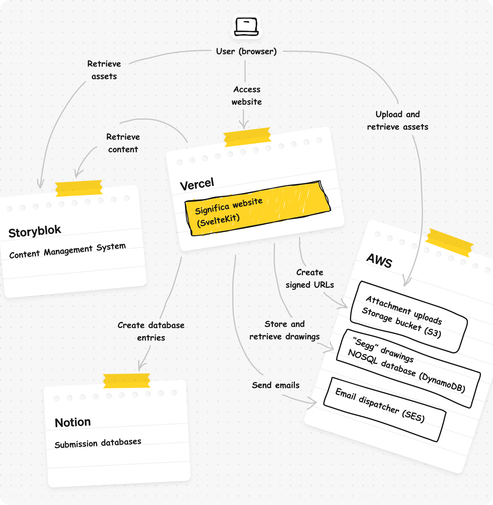

# Significa website

This is the repository with the source code for [Significa's website](https://significa.co/),
our very own nest on the web. We find it a work of art, but of course we are biased.

If you find it interesting, inspiring or learn something from it, make sure to leave a star ⭐️

## Architecture

We developed this website using **Svelte** + **SvelteKit**, and a custom UI library
`@significa/svelte-ui` published under
[significa/significa-svelte-ui](https://github.com/significa/significa-svelte-ui)

To accomplish all features, we leverage a few external services:

- CMS - Storyblok: It's where we configure the website, build pages, store and serve assets.
- Storage bucket - AWS S3: Used to store attachments, uploaded via the contact forms.
- Email dispatcher - AWS SES: Used to dispatch notification emails.
- NOSQL database - AWS Dynamo DB: Intended to store and retrieve egg drawings "seggs" drawn by our
  users.
- Form submission database - Notion: We create a new entry on a Notion database when someone
  submits a form. This way we can keep everything in a centralized space.

The website is hosted on Vercel, and deployed via GitHub Actions workflows.
All Continuous Integration (CI) validations are also made via GiHub Actions.

We have three distinct environments for the website:

- `local-development` for developers to develop and test their code on their machine;
- `staging` bounded to the `main` branch and preview deployments (pull requests);
- `production` deployed when a release is published.

This means that the whole infrastructure has a version for each environment.
Includes distinct keys and external and integrations: AWS resources, Notion applications,
databases, etc.

Here's how everything is connected (arrows represent the request initiator):

## Contributing

The development of this project follows an internal roadmap. Therefore we usually are only open to
improvements and bug-fixes.

### Requirements

- Install the node version specified in the [`.nvmrc`](./.nvmrc) file
  (using your favourite node version manager).

- Get the local development `.env` using
  [1password-secrets](https://github.com/significa/1password-secrets/):
  `1password-secrets local pull`.
  Or create one with based on the example in `.env.example`.

- Install the dependencies with `npm install` (or `npm ci` for a frozen lockfile).

### Development

- Start the development server: `npm run dev`
- Auto format the code: `npm run format`

### Testing and linting

- `npm run validate`
- `npm run test`

## Deployment and release

The staging branch is bounded to the `main` branch, create a PR against it for a new feature.

To deploy a new production version, create a semver release in GitHub
(prefixed with `v`, for example: `vX.X.X`).

To create hotfixes:

- Check-out to the latest release `git checkout vX.X.X`;
- Create a new branch `git checkout -b hotfix/XXXX`;
- Create a PR to `main`, get approval, and merge it;
- Create a new release based on your hotfix branch.
  Use `release/xxx` branches to batch fixes together.

## License

This material is licensed under the AGPL License, feel free remix-it, learn and play with it as
you wish. But note that distribution of the source code under the same license is mandatory.
