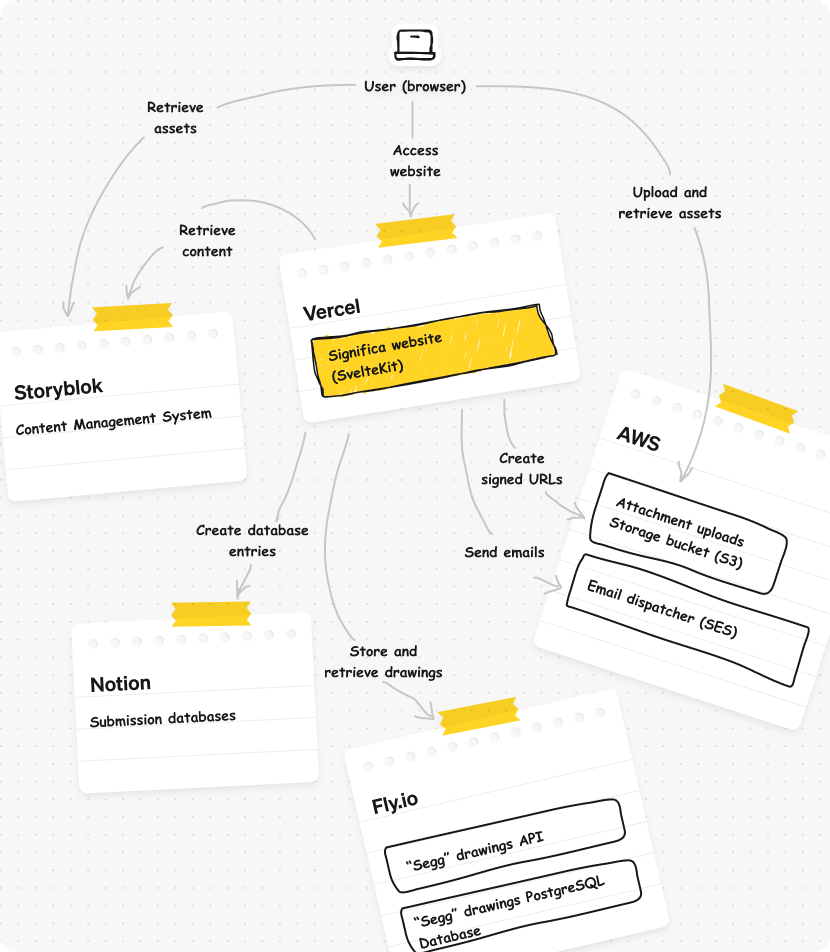

# Significa website

This is the repository with the source code for [Significa's website](https://significa.co/),
our very own nest on the web. We find it a work of art, but of course we are biased.

If you find it interesting, inspiring or learn something from it, make sure to leave a star ⭐️

## Architecture

We developed this website using **Svelte** + **SvelteKit**, and a custom UI library
`@significa/svelte-ui` published under
[significa/significa-svelte-ui](https://github.com/significa/significa-svelte-ui)

To accomplish all features, we leverage a few external services:

- CMS - Storyblok: It's where we configure the website, build pages, store and serve assets.
- Storage bucket - AWS S3: Used to store attachments, uploaded via the contact forms.
- Email dispatcher - AWS SES: Used to dispatch notification emails.
- Drawings API - Custom closed source API to store "seggs".
- Form submission database - Notion: We create a new entry on a Notion database when someone
  submits a form. This way we can keep everything in a centralized space.

The website is hosted on Vercel, and deployed via GitHub Actions workflows.
All Continuous Integration (CI) validations are also made via GiHub Actions.

We have three distinct environments for the website:

- `local-development` for developers to develop and test their code on their machine;
- `staging` bounded to the `main` branch and preview deployments (pull requests);
- `production` deployed when a release is published.

This means that the whole infrastructure has a version for each environment.
Includes distinct keys and external and integrations: AWS resources, Notion applications,
databases, etc.

Here's how everything is connected (arrows represent the request initiator):

<!-- Source: https://www.figma.com/design/FGnb9qYhXJo8w0tuHPveVF/Significa-Site-%E2%80%93-Design?node-id=4280-23782&p=f&t=ZAotyfyhPfWLmRnn-0 -->

## Contributing

The development of this project follows an internal roadmap. Therefore we usually are only open to
improvements and bug-fixes that do not have big impact in the features or project setup.

### Requirements

- Install the node version specified in the [`.nvmrc`](./.nvmrc) file
  (using your favourite node version manager).

- Get the local development `.env` using
  [1password-secrets](https://github.com/significa/1password-secrets/):
  `1password-secrets local pull`.
  Or create one with based on the example in `.env.example`.

- Install the dependencies with `npm install` (or `npm ci` for a frozen lockfile).

### Development

- Start the development server: `npm run dev`
- Auto format the code: `npm run format`

### Testing and linting

- `npm run validate`
- `npm run test`

## Deployment and release

The staging environment is bounded to the `main` branch, each new addition to this branch,
creates a new deployment to staging.

To deploy a new version to production, create a _semver_ compliant release in GitHub
(prefixed with `v`, for example: `vX.X.X`), it will be deployed automatically to production

To create hotfixes:

- Check-out to the latest release `git checkout vX.X.X`;
- Create a new branch `git checkout -b hotfix/XXXX`;
- Create a PR to `main`, get approval, and merge it;
- Create a new release based on your hotfix branch.
  Use `release/xxx` branches to batch fixes together.

## License

Licensed under the AGPL. This is **not** a traditional open-source project — it is _source available_,
published so people can **read it and learn from it**. It is not a template or a starter.

- **Do not host or serve this site over a network**, publicly or privately.
- **Do not fork it, change the branding, and ship it as your own** — that violates this license.
- Any redistribution must follow the AGPL: same license, attribution, full source disclosure.

Significa's branding (name, logo, copy, imagery, identity) is not covered by the AGPL and is not
licensed to you.

We do not provide support for this project.
